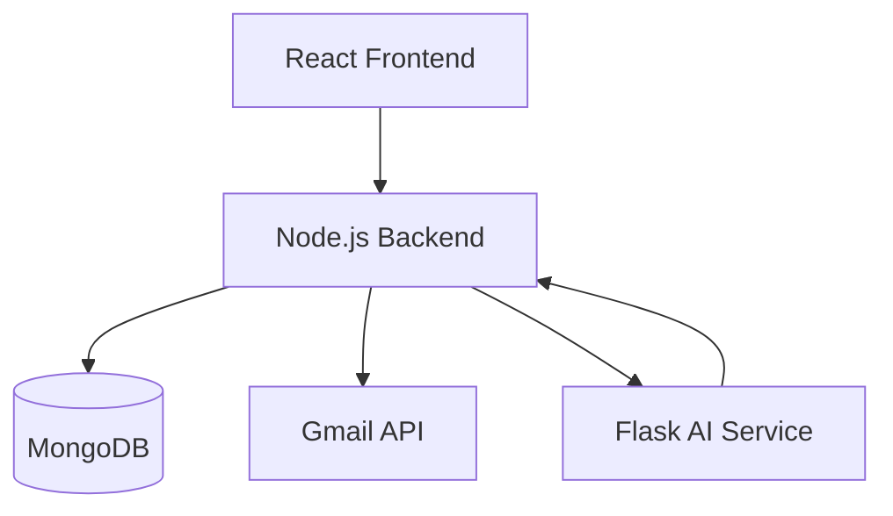

<div align="center">

<h1>InboxIQ: AI-Powered Email Triage & Automation</h1>

<p>
InboxIQ is an intelligent email assistant that transforms cluttered inboxes into organized, prioritized workflows.  
By combining semantic ML classification, Gmail automation, and LLM-powered assistance, InboxIQ enables users to automatically label, prioritize, summarize, and respond to emails in real time.
</p>

<!-- <h4>
<a href="https://your-frontend-url.vercel.app">Live Demo</a>
<span> · </span>
<a href="https://github.com/yourusername/InboxIQ">Repository</a>
<span> · </span>
<a href="https://your-presentation-link.com">Presentation</a>
</h4> -->

<br>

</div>

---

## 🚀 Overview

InboxIQ is built for professionals, students, and teams who want to:

* Automatically categorize emails
* Prioritize what truly matters
* Generate AI-powered replies
* Summarize long email threads
* Automate repetitive email workflows
* Personalize inbox behavior with custom categories

It converts raw inbox data into an intelligent, adaptive email management system.

---

## 🎯 Key Features

### 🧠 Semantic Email Classification (ML-Based)

* SentenceTransformers-powered embedding classifier
* Dynamic user-defined categories (no retraining required)
* Confidence-based classification
* CPU-optimized real-time inference

### ⭐ Intelligent Priority Engine

* Separate semantic classification and priority inference
* Rule-based importance detection (OTP, interviews, deadlines, etc.)
* User-controlled priority order
* Persistent per-user preferences (MongoDB)

### 💬 AI-Powered Email Assistance

* LLM-generated professional replies
* One-click AI auto-reply
* Smart summarization
* Context-aware automation

### ⚙️ Automation Engine

* Send emails via API
* Auto-label incoming emails
* Batch auto-reply workflows
* Gmail label synchronization

### 🎨 Modern Interactive Dashboard

* React + Vite frontend
* Dark / Light / System theme
* Animated UI with Framer Motion
* Drag-and-drop priority management
* Rich email editor (ReactQuill)

### 🔐 Secure Architecture

* Google OAuth authentication
* HttpOnly JWT cookies
* MongoDB-backed persistence
* Microservice AI architecture

---

## 🧠 Hybrid AI Architecture

InboxIQ uses a **hybrid intelligence pipeline**:

### 1️⃣ Fast Semantic Classifier (Primary)

* SentenceTransformers (`all-MiniLM-L6-v2`)
* Cosine similarity over category embeddings
* Real-time classification in milliseconds
* Dynamic support for new user categories

### 2️⃣ LLM (Gemini API)

Used only for:

* Email reply generation
* Summarization
* Complex reasoning tasks

This separation ensures:

* ⚡ High speed
* 💸 Reduced API cost
* 🧠 Strong ML engineering foundation
* 📈 Scalable performance

---

## 🧩 Core Capabilities

InboxIQ processes:

* Gmail messages via Gmail API
* Custom user-defined categories
* Multi-category prioritization
* Real-time AI automation
* Confidence-based routing

---

## 🛠 Tech Stack

### Backend (Node.js)

* Express.js
* Google Gmail API
* JWT Authentication
* MongoDB (Mongoose)
* Axios (Flask communication)

### AI Microservice (Flask)

* SentenceTransformers
* Scikit-learn (similarity)
* Gemini API
* Embedding caching & batching
* Confidence-based classification

### Frontend

* React + Vite
* TypeScript
* TailwindCSS
* Framer Motion
* Zustand (state management)
* React Quill (rich text editor)
* Lucide Icons

### Database

* MongoDB Atlas

---

## 🏗 System Architecture



---

## 🔄 Email Processing Pipeline

1️⃣ Fetch emails via Gmail API
2️⃣ Generate embeddings for email content
3️⃣ Compare against category embeddings
4️⃣ Assign semantic category
5️⃣ Apply confidence threshold
6️⃣ Optional priority inference
7️⃣ Auto-apply Gmail label
8️⃣ Store preferences persistently

---

## ⚙️ Local Setup

### 1️⃣ Clone Repository

```bash
git clone https://github.com/yourusername/InboxIQ
cd InboxIQ
```

---

### 2️⃣ Backend Setup

```bash
cd server
npm install
```

Create `.env`:

```
PORT=5000
MONGO_URI=your_mongodb_uri
JWT_SECRET=your_secret
GOOGLE_CLIENT_ID=your_client_id
GOOGLE_CLIENT_SECRET=your_client_secret
GOOGLE_REDIRECT_URI=http://localhost:5000/auth/google/callback
FLASK_AI_URL=http://localhost:8000
```

Run:

```bash
npm run dev
```

---

### 3️⃣ Flask AI Service

```bash
cd flask-service
python -m venv venv
venv\Scripts\activate
pip install -r requirements.txt
```

Create `.env`:

```
PORT=8000
GEMINI_API_KEY=your_gemini_key
```

Run:

```bash
python app.py
```

---

### 4️⃣ Frontend Setup

```bash
cd client
npm install
```

Create `.env`:

```
VITE_API_BASE=http://localhost:5000
```

Run:

```bash
npm run dev
```

---

## 📡 API Endpoints

| Feature      | Method | Endpoint               |
| ------------ | ------ | ---------------------- |
| Fetch Emails | GET    | /emails                |
| Classified   | GET    | /emails/classified     |
| Send         | POST   | /automation/send       |
| AI Reply     | POST   | /automation/reply      |
| Auto Reply   | POST   | /automation/auto-reply |
| Label        | POST   | /automation/label      |
| Summarize    | POST   | /automation/summarize  |
| Categories   | GET    | /categories            |
| Add Category | POST   | /categories/add        |
| Priority     | POST   | /categories/priority   |

---

## 📈 Example Use Cases

* Students managing placement emails
* Developers tracking technical updates
* Professionals prioritizing work vs promotions
* Automating repetitive replies
* Smart email triage for busy schedules

---

## 🔮 Future Roadmap

* Confidence-based LLM fallback classification
* Online learning from manual relabeling
* Background async classification queue
* Smart rule builder (if subject contains X → auto action)
* Gmail extension UI injection
* Thread-level summarization
* Analytics dashboard (email behavior insights)

---

## 🤝 Author

**Vaibhavi Pandey**
Integrated M.Tech CSE
Full-Stack + AI Engineering

---

## ⭐ Why InboxIQ?

Inbox overload reduces productivity.
Manual triage wastes time.

InboxIQ turns email into an intelligent, adaptive system —
where AI handles the noise and users focus on what matters.

---

© 2026 InboxIQ — Intelligent Email Automation
